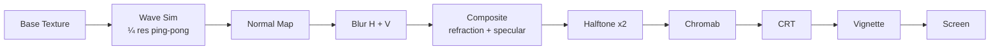

# Building a GPU-Accelerated Glass Ripple Effect: 11 Shader Passes Explained

Every AI product landing page looks the same. Gradient backgrounds. Floating particles. Maybe a Lottie animation. I wanted to build something different — an interactive surface that responds to the user with real physics, wrapped in a CRT retro aesthetic that nobody else is doing.

The result is [glass-ripple](https://github.com/ZenAlexa/glass-ripple): an 11-pass WebGL2 shader pipeline that turns any `<canvas>` into a reactive glass surface, with 52 built-in AI brand icons.

**[Live Demo](https://zenalexa.github.io/glass-ripple/)** | **[GitHub](https://github.com/ZenAlexa/glass-ripple)** | **[npm](https://www.npmjs.com/package/glass-ripple)**


## The Pipeline at a Glance

Every frame, glass-ripple runs 11 shader passes:

```
Wave Sim → Normal Map → Blur (H+V) → Composite → Halftone ×2 → Chromab → CRT → Vignette → Screen
```



All shaders are written in GLSL 300 ES and run through Three.js `ShaderMaterial`. Let me walk through each stage.

## Pass 1: Wave Simulation

The foundation is a 2D wave equation running on a ping-pong framebuffer. Two `HalfFloat` render targets alternate as source and destination each frame:

```
height += velocity
velocity += speed × (average_of_4_neighbors - height) - damping × velocity
```

This is the classic discretization of the 2D wave equation. The mouse position pushes height values into the simulation, creating ripples that propagate outward.

**Key optimization:** The wave sim runs at **quarter resolution** (W/4 × H/4). Full-resolution simulation was ~3x slower and visually indistinguishable after the blur pass smooths everything out.

**Key decision:** Mouse interaction computes distance to a **line segment** between the previous and current mouse positions, not just a point distance. This creates continuous wake trails — without it, fast mouse movements produce dotted ripple patterns with visible gaps.

## Pass 2: Normal Map from Heightfield

The wave simulation gives us a heightfield. To create the glass refraction effect, we need surface normals. These are computed via finite differences — sampling the height at neighboring texels and computing the cross product.

One hard-won lesson: the z-component of the normal **must be +1.0**, not -1.0. Setting z=-1 inverts the lighting model and darkens the entire scene. This took longer to debug than I'd like to admit.

## Passes 3-4: Gaussian Blur

A separable Gaussian blur (horizontal pass, then vertical pass) smooths the normal map. This runs at the same quarter resolution as the wave sim. The blur softens the ripple edges and creates a more natural glass-like refraction in the next pass.

## Pass 5: Composite

This is where the magic happens. The composite shader takes the blurred normal map and the base texture (background + icon), and uses the normals to:

1. **Refract** — offset UV coordinates into the base texture based on the normal direction, simulating light bending through glass
2. **Add specular highlights** — compute a simple specular term from the normals for bright caustic-like reflections

The `texelScale` parameter (approximately 7.72) controls how aggressively the normals distort the base image.

## Passes 6-7: Halftone (Two Layers)

Two halftone passes at different scales and rotation angles create a layered dot pattern:

- **Pass 1:** Dark dots, scale 0.42, angle -0.4833 rad
- **Pass 2:** Warm-tinted dots (amber), scale 0.8, angle -0.0081 rad

The layered approach creates a richer texture than a single halftone pass. Each pass blends with a configurable mix factor.

## Pass 8: Chromatic Aberration

RGB channels are sampled at slightly offset UV coordinates, simulating the color fringing you see in imperfect lenses. The offset amount (default 0.2) is subtle but adds to the analog feel.

## Pass 9: CRT Scanlines

The retro CRT effect simulates phosphor cells and scanline gaps. A `cellScale` of 0.028 creates fine scanlines, and a `glow` of 0.5 adds the characteristic phosphor bloom. This is what gives glass-ripple its distinctive look.

## Pass 10: Vignette

Edge darkening draws the eye to the center. This is the final pass and renders directly to the screen (no intermediate render target), saving one GPU blit.

## The Icon System

glass-ripple ships with 52 AI brand icon presets — covering models, creative AI tools, developer tools, and cloud infrastructure:

- **AI Models (22):** Claude, OpenAI, Gemini, DeepSeek, Grok, Mistral, Qwen, Perplexity...
- **Creative AI (8):** Midjourney, Runway, Suno, DALL-E, Flux...
- **Dev Tools (14):** Cursor, Copilot, Windsurf, Cline, Dify, Ollama...
- **Cloud/GPU (8):** NVIDIA, AWS, Azure, Cloudflare...

Icons use a discriminated union type:

```ts
// Single SVG path — renders synchronously via Path2D
interface SvgPathIcon {
  svgPath: string;
  color?: string;
  viewBox?: number;
  scale?: number;
  position?: { x: number; y: number };
}

// Full SVG markup — renders asynchronously via Image decode
interface SvgStringIcon {
  svg: string;
  scale?: number;
  position?: { x: number; y: number };
}

type IconConfig = SvgPathIcon | SvgStringIcon;
```

All 52 presets use `SvgPathIcon` for instant rendering. The `SvgStringIcon` variant exists for custom multi-path or gradient icons.

Icons are tree-shakeable:

```ts
import { claude, openai } from 'glass-ripple/icons';  // only these two are bundled
```

## Quick Start

```bash
npm install glass-ripple three
```

```ts
import { GlassRipple } from 'glass-ripple';
import { claude } from 'glass-ripple/icons';

const ripple = new GlassRipple({
  canvas: document.getElementById('canvas') as HTMLCanvasElement,
  icon: claude.icon,
});
```

Three lines. The library handles the renderer, event listeners, animation loop, and all GPU resources. Swap icons at runtime:

```ts
import { openai, deepseek } from 'glass-ripple/icons';

await ripple.setIcon(openai.icon);   // smooth crossfade transition
ripple.setTint('#00ff88');            // change halftone tint color
```

Every effect can be individually disabled:

```ts
const ripple = new GlassRipple({
  canvas,
  icon: claude.icon,
  effects: {
    halftone: false,     // disable both halftone passes
    chromab: false,       // disable chromatic aberration
    retroScreen: false,   // disable CRT effect
    vignette: false,      // disable vignette
  },
});
```

## What's Next

- More icon presets as new AI models and tools launch
- Configurable wave equation variants (shallow water, damped harmonic)
- Touch interaction improvements for mobile
- Performance profiling on lower-end GPUs

The AI landscape moves fast. If your favorite model or tool isn't in the preset list yet, that's a great first PR — adding an icon is one file and one line.

**[GitHub](https://github.com/ZenAlexa/glass-ripple)** | **[npm](https://www.npmjs.com/package/glass-ripple)** | **[Live Demo](https://zenalexa.github.io/glass-ripple/)**

MIT licensed. Built by [Ziming Wang](https://github.com/ZenAlexa).

---

*Dev.to tags: #webgl #javascript #threejs #opensource*
